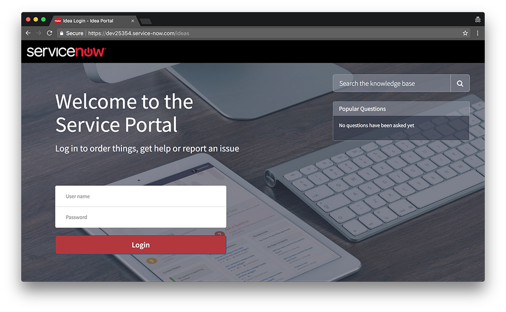
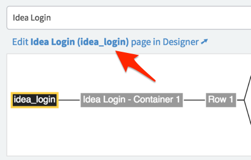
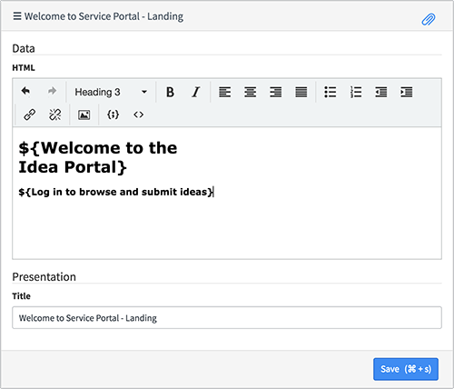
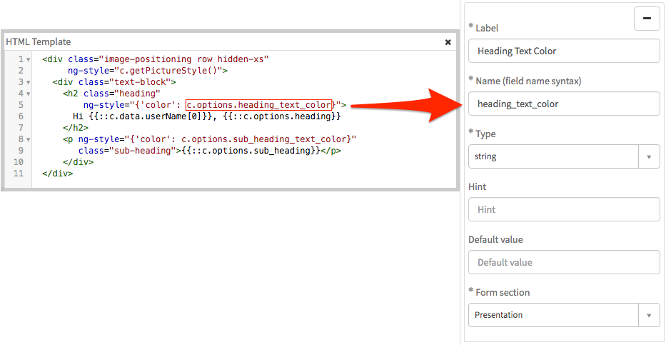
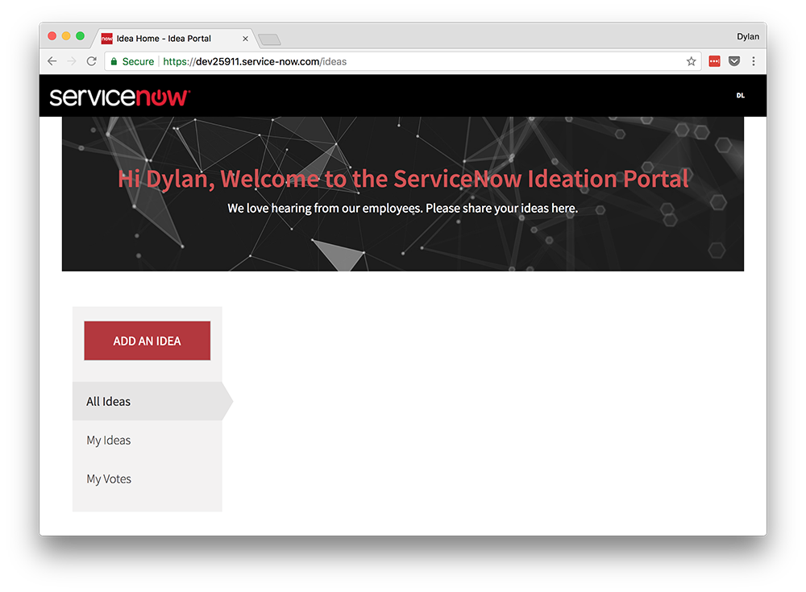
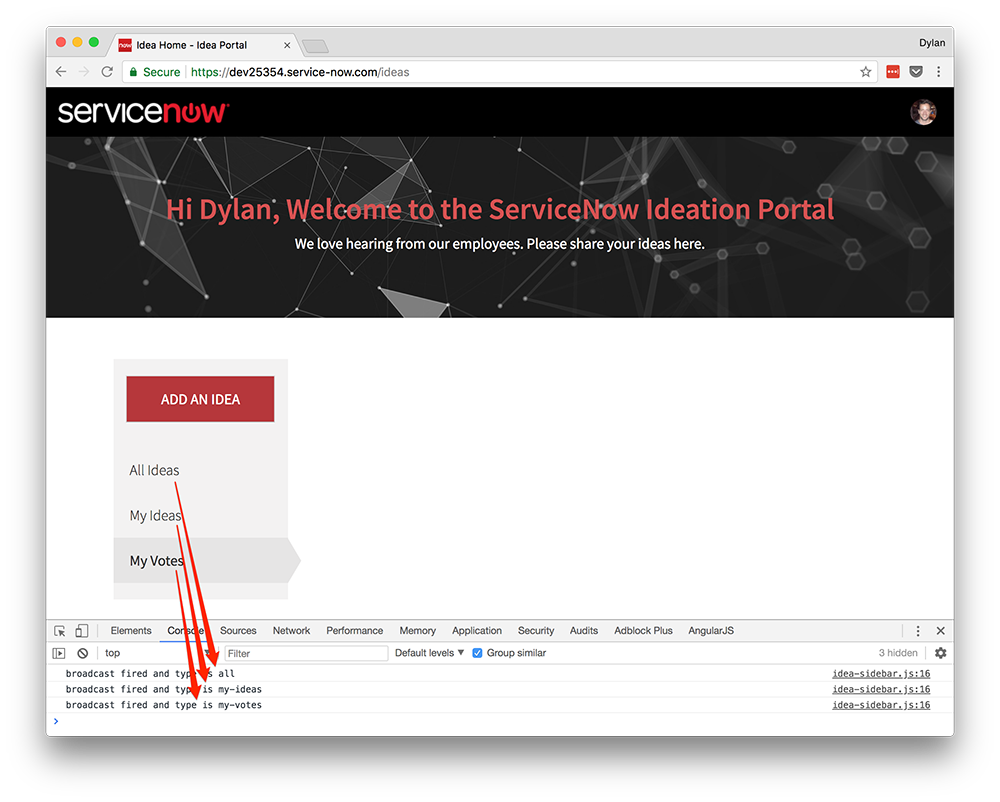

# Introduction
## What is Service Portal?
// TODO

## Service Portal Core Concepts
// TODO

# Lab 1: The Portal Record
## Goal
In this lab we will configure our Portal record, and the Theme associated with it.

## Create the Portal
1.	Open your web browser and navigate to the URL of your instance.

2. Login as `admin`.
3.	In the application navigator, search for and open **Studio**, and pick the **Idea Portal** application (this has been pre-loaded onto your instance).
4. In Studio, under the **Service Portals** heading, click on **Idea Portal**.
5. Notice the **URL Suffix** to access this portal is `ideas`.
6.	Download **[`logo-rev.png`](resources/lab-01/logo-rev.png)**, upload it to the **Logo** field, and press **Save**.
7.	This portal is associated with the **Idea Portal** theme. Click on the  icon next to the **Theme** field to open the record.
8. Update the Idea Portal record to have the values below, then press **Save**:

	| Field         | New Value                                 |
	|---------------|-------------------------------------------|
	| Header        | Stock Header *(we will use the OOB header)* |
	| CSS Variables | *Contents of [theme.css](scripts/lab-01/theme.css)*|

# Lab 2: Cloning and Creating Pages
## Goal
In this lab we will clone an existing page, modify it, and create new pages for our portal.

## Cloning Existing Pages
1. In the application navigator, search for **Pages**, and open the result under the **Service Portal** application.

2. Search for and open the page with the **ID** `landing`.
3. Click on the **Clone Page** button (located to the top right of the page).
4. Change the cloned page's title to **Idea Login**.
5. Copy the new title, and paste it into the **ID** field. When you click out of the field you will notice the value is automatically converted to lowercase, and spaces will be replaced with underscores. This is because the page's ID is used in the URL when accessing the page, and URL's are case insensitive and don't support spaces.
6. Press **Update**.
7. In Studio, navigate to the **Idea Portal** record. Update the **Login page** field to point to the newly-cloned `idea_login` page. Save the record.

### Verify the Changes
Open a browser which you're not logged into (or an "incognito" window) and navigate to `/ideas` on your instance. You should see the below page.



## Modify the Cloned Page
1. In Studio, open the **Idea Login** page (under **Service Portal** ► **Service Portal Pages**).
	
2. In the tree at the top of the window, click the `idea_login` node.
	
3. Let's change the background image of the Idea Login page.

	On line 8, under **Page Specific CSS** you can see the background image hard-coded on this line:

	```
	background-image: url('sp-landing-back.jpg');

	``` 
	
	Change the image name from `sp-landing-back.jpg` to `Login_bg.jpg` and save the record. Line 8 should now look like this:
	
	```
	background-image: url('Login_bg.jpg');
	
	```
	`login_bg.jpg` is an image from the `db_image` table; It's been pre-loaded on your intance.
4. Open the page in Service Portal Designer by clicking on the **Edit Idea Login (idea_login) page in Designer** link.

	
5. There are 5 widgets on the page:
	- HTML
	- Login
	- Typeahead Search
	- Popular Questions
	- Language Switch
	
	We don't need the **Typeahead Search**, **Popular Questions**, or **Language Switch** widgets on our page. Remove these unneeded widgets from the page by hovering over them, and clicking on the trash/bin icon.
	
	
	
6. Let's edit the text on the page. Hover over the **HTML** widget, and click the pencil icon. The options for this particular instance of the HTML widget will open. Change the heading text to say *Welcome to the Idea Portal* and the smaller text to say *Log in to browse or submit ideas*. Press **Save**.

	
	

### Verify the Changes.

Open a browser which you're not logged into (or an "incognito" window) and navigate to `/ideas` on your instance. You should see the below page.


## Creating a Page
1. In Studio, click **Create Application File**. Search for and click on **Service Portal Page**, then click **Create**.
	
2. Set **Idea Home** as the **Page title**. The **Page ID** will automatically populate as `idea_home`. Click **Submit**.
3. Every new page has a default container already on it. We need another one. Drag and drop a continer below the existing one from the Layouts area of the left-hand panel. Your page should now look like this:
	
	
	
4. Since our first container needs to expand across the full width of the page, we will need to make it **Fluid** (instead of the default which is Fixed).

	Select the first container on the page by clicking on it. The border of the selected container will highlight blue. Now, click the pencil icon in the top-right corner of the page. In the dialog which appears, change the **Width** field to **Fluid** and press **Save**.
	
5. Drag and drop a **12** column layout from the Layouts panel into the first container, and a **3 | 9** column layout into the second container.
6. In Studio, open the **Idea Portal** record (under **Service Portal** ► **Service Portals**).
7. As the **Homepage**, select `idea_home` and press **Save**.

# Lab 3: Banner Widget
## Goal
In this lab we will create a customizable banner widget

## Banner Widget
1. For convenience, we have included the **Idea Banner** widget on your instance, but it's empty. Find this widget in Studio, and open it.

2. Click the hamburger menu at the top-right corner of the widget editor , and click **Open in platform**
3. There's quite a bit of code that makes up this widget, so you can copy and paste the code into the corresponding fields from the below links, then save the record:
	- [Body HTML template](scripts/lab-03/banner-body-html-template.html)
	- [CSS](scripts/lab-03/banner-css.scss)
	- [Server script](scripts/lab-03/banner-server-script.js)
	- [Client controller](scripts/lab-03/banner-client-controller.js)
	- [Option schema](scripts/lab-03/banner-option-schema.json)

4. Let's add this widget to our home page. In Studio, click on **Idea Home** (under **Service Portal** ► **Service Portal Pages**).
5. In the window that opens, click the **Edit Idea Home (idea_home) page in Designer** link.
6. In the panel on the left, find our **Idea Banner** widget, and drag and drop it into our 12 column layout in the first container.
7. Hover over the widget that's now in the container, and click the pencil icon. You will see 4 options you can configure on this widget. Fill in the options as follows, and press **Save**.

	| Option         | Value                                 |
	|---------------|-------------------------------------------|
	| Background Image        | idea_banner.jpg |
	| Align Image | center |
	| Heading | Welcome to the ServiceNow Ideation Portal |
	| Heading Text Color | #d9534f |

8. Let's add a few more options for this widget. Click on the **Idea Banner** widget in Studio, click on the hamburger menu at the top-right corner of the widget editor , and click **Edit option schema**.
9. We are going to add two new options. In the **Widget Option Schema** popup, you can click on the plus icon to add a new option. Create the following two options:

	| Field         | Value                                 |
	|---------------|-------------------------------------------|
	| Label        | Sub Heading |
	| Name | sub_heading |
	| Type | string |
	| Form section | Presentation |
	
	| Field         | Value                                 |
	|---------------|-------------------------------------------|
	| Label        | Sub Heading Text Color |
	| Name | sub\_heading\_text_color |
	| Type | string |
	| Form section | Presentation |

10. In Studio, open the **Idea Home** page. In the window that opens, click the **Edit Idea Home (idea_home) page in Designer** link.
11. Open the options for the **Idea Banner** widget (the same way as was done in step 7). Fill in the new options we created as follows, and press **Save**.

	| Option         | Value                                 |
	|---------------|-------------------------------------------|
	| Sub Heading        | We love hearing from our employees. Please share your ideas here. |
	| Sub Heading Text Colour | #fff |


### How it Works
Click on the **Idea Banner** widget in Studio, and refer to the **HTML Template** pane.

- AngularJS has a built-in directive called [ngStyle](https://docs.angularjs.org/api/ng/directive/ngStyle). With this directive you can set the values of CSS styles based on the results of an AngularJS expression. The expression can be a call to a function, or simply an in-line JSON object. Widget options can easily be accessed within this JSON object using the format `c.options.YOUR_OPTION_NAME`.

	

- In lines **4** and **6**, we are attaching the ngStyle directive to the `div` by using the attribute `ng-style`. As a value for this attribute, we have an in-line JSON object which directly refers to the widget options. This is setting the color of the text to be whatever value is stored in that option.
- In line **2** of the HTML, we are using the same attribute `ng-style` but instead of having the JSON object inline, we are calling the function `c.getPictureStyle()` which returns the JSON object.

# Lab 4: Sidebar Widget
## Goal
In this lab we will create a sidebar widget which talks to the Idea List widget we will create in Lab 5.

## Create the Widget
1. In Studio, click **Create Application File**, search for and choose **Widget**, and click **Create**.

2. Click the **Create a new widget** link. Use the below values in the fields, and choose **Submit**.

	| Field         | Value                                 |
	|---------------|-------------------------------------------|
	| Widget Name  | Idea Sidebar |
	| Widget ID | idea-sidebar |
	
3. There's quite a bit of code that makes up this widget, so you can copy and paste the code into the corresponding fields from the below links, then save the record:
	- [Body HTML template](scripts/lab-04/banner-body-html-template.html)
	- [CSS](scripts/lab-04/banner-css.scss)
	- [Client controller](scripts/lab-04/banner-client-controller.js)

4. Now, open the **Idea Home** page in Service Portal Designer, and drag and drop the new **Idea Sidebar** widget we've created into the **3** column area of the second container.

	**NOTE:** if the widget doesn’t appear in the list of widgets in Service Portal Designer you may need to refresh the page.

### How it Works

Open a new tab in your browser and navigate to `/ideas` on your instance. You should see the below page.



When a widget loads, it's client controller's `$onInit` function gets executed (like a constructor). In there, we are setting the `c.selectedFilter` variable to have the value `all`.


Looking at the code in the HTML template of the widget, on line **3** we have bound the **ngClick** directive to the `button` element using the `ng-click` attribute. This directive simply executes the expression in the value of the attribute. In this case, we are telling it to call the `c.submitIdea()` function.


The three `a` elements are links which will act as filters for the idea list widget we will build in lab 5. Again, we are using the **ngClick** directive on each of these elements to call a function, this time `c.filterClicked()`. We are passing it a parameter so that the function can update `c.selectedFilter`.

We are also using the **ngClass** directive on these elements, which attaches CSS classes to an element if the expression returns `true`. If the current value of `c.selectedFilter` is the one related to this link, the `active` class will be added to it, allowing us to add styling to it to appear selected.

## Communicating Between Widgets

The `c.filterClicked()` function doesn't just update the value of `c.selectedFilter` though! Let's have a look at what it does:


On line **22**, we are using the `$rootScope` service, and the `$broadcast` function on it to broadcast the `filterClicked` event to other widgets and components on the page. We will catch this event in the **Idea List** widget.

### How it Works
Open a new tab in your browser and navigate to `/ideas` on your instance. Open the console by right-clicking anywhere on the page and clicking inspect element. When you click on links you should see logs appear as shown in the screenshot below. These are coming from line **20** in the screenshot above, and show that upon clicking the link the `c.filterClicked` function is executing and the event has been broadcast.



# Lab 5: List Widget
## Goal
In this lab we will create the Idea List widget. This widget will listen to the Idea Sidebar widget we created in Lab 4.

## Create the Widget
1. In Studio, click **Create Application File**, search for and choose **Widget**, and click **Create**.

2. Click the **Create a new widget** link. Use the below values in the fields, and choose **Submit**.

	| Field         | Value                                 |
	|---------------|-------------------------------------------|
	| Widget Name  | Idea List |
	| Widget ID | idea-list |
	
3. There's quite a bit of code that makes up this widget, so you can copy and paste the code into the corresponding fields from the below links, then save the record:
	- [Body HTML template](scripts/lab-05/banner-body-html-template.html)
	- [CSS](scripts/lab-05/banner-css.scss)
	- [Client controller](scripts/lab-05/banner-client-controller.js)

4. Now, open the **Idea Home** page in Service Portal Designer, and drag and drop the new **Idea List** widget we've created into the **9** column area of the second container.

	**NOTE:** if the widget doesn’t appear in the list of widgets in Service Portal Designer you may need to refresh the page.
	
### Verify the Changes

Open a new tab in your browser and navigate to `/ideas` on your instance. You should see the below page.

## Idea Votes Schema
// TODO

## Get Data via REST API
// TODO
### Verify the Changes
// TODO

## Record Watcher
// TODO
### Verify the Changes
// TODO

## Moment.js
// TODO

## Widget Communication (contd.)
// TODO
### Verify the Changes
// TODO

## Using an External Library
// TODO
### Verify the Changes
// TODO


# Lab 6: Submit an Idea Page
## Goal
// TODO
## Create the Page
// TODO

## Navigating Between Pages Using `$location`
// TODO

# Bonus Lab: Data Tables
## Goal
In this lab we create a customizable banner widget by using the Data Table concept.
## Customisable Banner Widget
// TODO
## Extending the `sp_instance` Table
// TODO
### Verify the Changes
// TODO

# Resources
## Glossary
// TODO


## Useful Links
### ServiceNow Resources
- [Widget Communication](https://community.servicenow.com/community/develop/blog/2016/06/26/how-to-communicate-between-two-widgets-in-service-portal)

### Non-ServiceNow Resources
- [Service Portal Fundamentals: AngularJS Scopes](https://www.dylanlindgren.com/2017/10/28/service-portal-fundamentals-angularjs-scopes/)
- [Animate.css](https://daneden.github.io/animate.css/)
- [Moment.js](https://momentjs.com/)