# Lab 1: The Portal Record
## Goal
In this lab you will learn how to configure portals and customise their theme.

## Create the Portal
1.	Open your web browser and navigate to the URL of your instance.

2. Login as an administrator (e.g. `admin`).
3.	In the application navigator, search for and open **Studio**, and pick the **Idea Portal** application.
4. In Studio, under the **Service Portals** heading, click on **Idea Portal**.

	Notice the **URL Suffix** to access this portal is `ideas`.
6.	Download **`logo-rev.png`** ([link](resources/lab-01/logo-rev.png)), upload it to the **Logo** field, and press **Save**.
7.	This portal is associated with the **Idea Portal** theme. Click on the  icon next to the **Theme** field to open the record.
8. Update the Idea Portal theme record to have the values below, then press **Save**.

	| Field         | New Value                                 |
	|---------------|-------------------------------------------|
	| Header        | Stock Header *(we will use the OOB header)* |
	| CSS Variables | *Contents of [theme.css](scripts/lab-01/theme.css.txt)*|

# Lab 2: Cloning and Creating Pages
## Goal
In this lab we will create a login page for our portal, and the home page which will allow users to view and vote on ideas.

## Cloning Existing Pages
1. In the application navigator, search for **Pages**, and open the result under the **Service Portal** application.

2. Search for and open the page with the **ID** `landing`.
3. Click on the **Clone Page** button (located to the top-right of the form).
4. Change the cloned page's title to **Idea Login**.
5. Copy the new title, and paste it into the **ID** field, and click out of the field.

	When you click out of the field you will notice the value is automatically converted to lowercase, and spaces will be replaced with underscores. This is because the page's ID is used in the URL when accessing it, and URL's are case insensitive and don't support spaces.
6. Press **Update**.
7. In Studio, navigate to the **Idea Portal** record again. Update the **Login page** field to point to the newly-cloned `idea_login` page, then save the record.

### Verify the Changes
Open a browser which you're not logged into (or an "incognito" window) and navigate to `/ideas` on your instance. You should see the below page.


## Modifying Pages
1. In Studio, open the **Idea Login** page (under **Service Portal** ► **Service Portal Pages**).
	
2. In the tree at the top of the window, click the `idea_login` node.

	
3. Let's change the background image of the page.

	In the **Page Specific CSS** field, on line **8** you can see the background image hard-coded on this line:

	```
	background-image: url('sp-landing-back.jpg');
	``` 
	
	Change the image name from `sp-landing-back.jpg` to `login-bg.jpg` and save the record. The line should now look like this:
	
	```
	background-image: url('login-bg.jpg');
	```
	
	`login-bg.jpg` is simply an image from the `db_image` table which has already been loaded on your instance.
4. Open the page in **Service Portal Designer** by clicking on the **Edit Idea Login (idea_login) page in Designer** link.

	
5. There are 5 widgets on the page:
	- HTML
	- Login
	- Typeahead Search
	- Popular Questions
	- Language Switch
	
	We don't need the **Typeahead Search**, **Popular Questions**, or **Language Switch** widgets on our page. Remove these from the page by hovering over them, and clicking on the trash/bin icon.
	
	
	
6. Let's edit the text on the page. Hover over the **HTML** widget, and click the pencil icon. The options for this particular instance of the HTML widget will open. Change the heading text to say "*Welcome to the Idea Portal*" and the smaller text to say "*Log in to browse and submit ideas*". Press **Save**.

	
	
	You might be wondering what the dollar signs and curly braces are doing around the text. These are related to [internationalization](https://docs.servicenow.com/bundle/jakarta-servicenow-platform/page/build/service-portal/concept/c_WidgetLocalization.html). If the user visiting the portal is using another language, this text can be automatically replaced with a translation of that phrase from the `sys_ui_messages` table.
	

### Verify the Changes

Open a browser which you're not logged into (or an "incognito" window) and navigate to `/ideas` on your instance. You should see the below page.

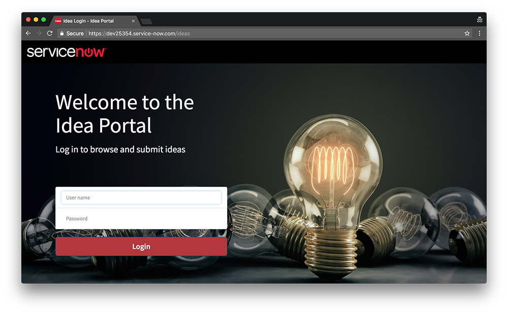

## Creating Pages
1. In Studio, click **Create Application File**. Search for and click on **Service Portal Page**, then click **Create**.
	
2. Set **Idea Home** as the **Page title**. The **Page ID** will automatically populate as `idea_home`. Click **Submit**.
3. Every new page has a default container already on it, but we need two. Drag and drop a container below the existing one from the **Layouts** area of the left-hand panel. Your page should now look like this:
	
	
	
4. Since our first container needs to expand across the full width of the page, we will need to make it **Fluid** (instead of the default which is Fixed).

	Select the first container on the page by clicking on it. The border of the selected container will highlight blue. Now, click the pencil icon in the top-right corner of the window. In the dialog that appears, change the **Width** field to **Fluid** and press **Save**.
	
5. Drag and drop a **12** column layout from the Layouts panel into the first container, and a **3 | 9** column layout into the second container.
6. Back in Studio, open the **Idea Portal** record again (under **Service Portal** ► **Service Portals**).
7. As the **Homepage**, select `idea_home` and press **Save**.

# Lab 3: Banner Widget
## Goal
In this lab we will learn how to create widgets that are customizable.

## Banner Widget
1. For convenience, we have included the **Idea Banner** widget on your instance, but it's empty. Find this widget in Studio, and open it.

2. Click the hamburger menu at the top-right corner of the widget editor (), and click **Open in platform**
3. There's quite a bit of code that makes up this widget, so for convenience you can copy and paste the code into the corresponding fields from the below links. After doing so, press the **Update** button to save the record.
	- [Body HTML template](scripts/lab-03/banner-body-html-template.html.txt)
	- [CSS](scripts/lab-03/banner-css.scss.txt)
	- [Server script](scripts/lab-03/banner-server-script.js.txt)
	- [Client controller](scripts/lab-03/banner-client-controller.js.txt)
	- [Option schema](scripts/lab-03/banner-option-schema.json.txt)

4. Let's add this widget to our home page. In Studio, click on **Idea Home** (under **Service Portal** ► **Service Portal Pages**).
5. In the window that opens, click the **Edit Idea Home (idea_home) page in Designer** link.
6. In the **Widgets** area of the left-hand panel, find our **Idea Banner** widget, and drag and drop it into our **12** column layout in the first container.
7. Hover over the widget that's now in the container, and click the pencil icon. You will see four options you can configure on this widget. Fill in the options as follows, and press **Save**.

	| Option         | Value                                 |
	|---------------|-------------------------------------------|
	| Heading | Welcome to the ServiceNow Ideation Portal |
	| Background Image        | idea-banner.jpg |
	| Align Image | center |
	| Heading Text Color | #d9534f |

8. Let's add a few more options for this widget. Click on the **Idea Banner** widget in Studio, click on the hamburger menu again, but this time click **Edit option schema**.
9. We are going to add two new options. In the **Widget Option Schema** popup, you can click on the plus icon to add a new option.

	Create the following two options, then press **Save** on the widget options dialog:

	| Field         | Value                                 |
	|---------------|-------------------------------------------|
	| Label        | Sub Heading |
	| Name | sub_heading |
	| Type | string |
	| Form section | Data |
	
	| Field         | Value                                 |
	|---------------|-------------------------------------------|
	| Label        | Sub Heading Text Color |
	| Name | sub\_heading\_text_color |
	| Type | string |
	| Form section | Presentation |
	
10. Press **Save** in the widget editor to save your changes to this widget.

11. In Studio, open the **Idea Home** page. In the window that opens, click the **Edit Idea Home (idea_home) page in Designer** link.
12. Open the options for the **Idea Banner** widget (the same way as was done in step 7). Fill in the new options we created as follows, and press **Save**.

	| Option         | Value                                 |
	|---------------|-------------------------------------------|
	| Sub Heading        | We love hearing from our employees. Please share your ideas here. |
	| Sub Heading Text Colour | #fff |

### How it Works
Click on the **Idea Banner** widget in Studio, and refer to the **HTML Template** pane.

- AngularJS has a built-in directive called **[ngStyle](https://docs.angularjs.org/api/ng/directive/ngStyle)**. With this directive you can set the values of CSS styles based on the results of an AngularJS expression. The expression can be a call to a function, or simply an in-line JSON object. Widget options can easily be accessed within this JSON object using the format `c.options.YOUR_OPTION_NAME`, as shown below.

	

- On lines **5** and **8**, we are attaching the ngStyle directive to the element by using the attribute `ng-style`. As a value for this attribute, we are using an in-line JSON object which directly refers to the widget options. This is setting the color of the text to be whatever value is stored in that option.
- On line **2** of the HTML, we are using the same attribute `ng-style`, but instead of having the JSON object inline we are calling the function `c.getPictureStyle()`. This function returns the JSON object, which saves us from having to have it in-line (it could get quite lengthy!).

# Lab 4: Sidebar Widget
## Goal
In this lab we will learn how to create widgets which control the behaviour of other widgets.

## Creating Widgets
1. In Studio, click **Create Application File**, search for and choose **Widget**, and click **Create**.

2. Click the **Create a new widget** link. Use the below values in the fields, and click **Submit**.

	| Field         | Value                                 |
	|---------------|-------------------------------------------|
	| Widget Name  | Idea Sidebar |
	| Widget ID | idea-sidebar |
	
3. There's quite a bit of code that makes up this widget, so you can copy and paste the code into the corresponding fields from the below links, then save the record:
	- [HTML template](scripts/lab-04/idea-sidebar-body-html-template.html.txt)
	- [CSS - SCSS](scripts/lab-04/idea-sidebar-css.scss.txt)
	- [Client Script](scripts/lab-04/idea-sidebar-client-controller.js.txt)

	**NOTE:** if you can't see the **CSS - SCSS** field, ensure the box to display it is ticked at the top of the widget editor.

4. Now, open the **Idea Home** page in Service Portal Designer, and drag and drop the new **Idea Sidebar** widget we've created into the **3** column area of the second container.

	**NOTE:** if you can't find the widget in Service Portal Designer you may need to refresh the page.

### Verify the Changes

Open a new tab in your browser and navigate to `/ideas` on your instance. You should see the below page.


### How it Works

- When a widget loads, it's client controller's `$onInit` function gets executed (like a constructor). In there, we are setting the `c.selectedFilter` variable to have the value `all`.

	

Looking at the code in the HTML template of the widget:

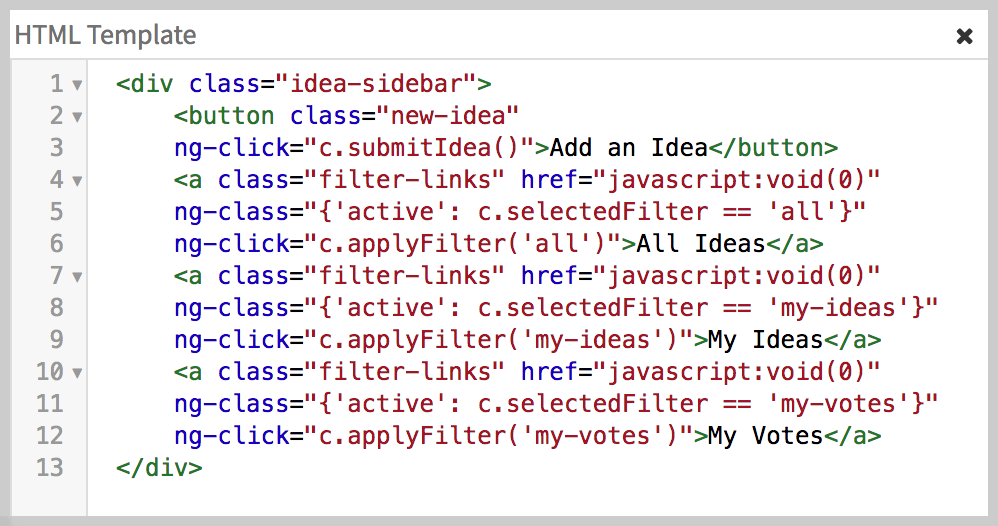

-	On line **3** we have bound the **ngClick** directive to the `button` element using the `ng-click` attribute. This directive simply executes the expression in the value of the attribute when the element is clicked. In this case, we are telling it to call the `c.submitIdea()` function when this happens.

- The three `a` elements are links which will act as filters for the Idea List widget we will build in lab 5. Again, we are using the **ngClick** directive on each of these elements to call a function when they are clicked, this time the `c.applyFilter()` function. We are passing it a parameter so that the function can update `c.selectedFilter`.

- We are also using the **ngClass** directive on these elements, which attaches CSS classes to an element if the expression returns `true`. If the current value of `c.selectedFilter` is the one related to this link, the `active` class will be added to it, allowing us to add styling to it to appear selected.

## Communicating Between Widgets

The `c.applyFilter()` function doesn't just update the value of `c.selectedFilter` though! Let's have a look at what else it does:


On line **29**, we are using the `$rootScope` service, and the `$broadcast` function on it to broadcast the `ideaPortal.applyFilter` event to other widgets and components on the page. This event name is nothing special; it's just something we made up. We will catch this event in the **Idea List** widget.

### How it Works
Open a new tab in your browser and navigate to `/ideas` on your instance. Open the console by right-clicking anywhere on the page and clicking inspect element. When you click on links you should see logs appear as shown in the screenshot below. These are coming from line **20** in the screenshot above, and show that upon clicking the link the `c.filterClicked` function is executing and the event has been broadcast.


# Lab 5: List Widget
## Goal
In this lab we will learn how to use a widget to display data, and how to retrieve updated data.

We will also learn how to use external libraries within your widget to add extra functionality to them withought having to develop this functionality from scratch.

## Create the Widget
1. In Studio, click **Create Application File**, search for and choose **Widget**, and click **Create**.

2. Click the **Create a new widget** link. Use the below values in the fields, and choose **Submit**.

	| Field         | Value                                 |
	|---------------|-------------------------------------------|
	| Widget Name  | Idea List |
	| Widget ID | idea-list |
	
3. There's quite a bit of code that makes up this widget, so you can copy and paste the code into the corresponding fields from the below links, then save the record:
	- [Body HTML template](scripts/lab-05/idea-list-body-html-template.html.txt)
	- [CSS](scripts/lab-05/idea-list-css.scss.txt)
	- [Client controller](scripts/lab-05/idea-list-client-controller.js.txt)

4. Now, open the **Idea Home** page in Service Portal Designer, and drag and drop the new **Idea List** widget we've created into the **9** column area of the second container.

	**NOTE:** if you can't find the widget in Service Portal Designer you may need to refresh the page.
	
### Verify the Changes

Open a new tab in your browser and navigate to `/ideas` on your instance. You should see the below page.


## The Votes Table

Ideas are stored in the out-of-box **Idea** table (`idea`), which is part of the **Project Portfolio Suite with Financials** plugin. We have created a custom table called **Vote** to store votes (`x_snc_idea_portal_vote`). Below you can see the schema diagram for the table:

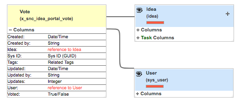

The table has 3 fields of interest:

- **User** - a reference field, to record the user who voted.
- **Idea** - a reference field, to record the idea the user voted for.
- **Voted** - a true/false field, to allow users to vote and "un-vote" for an idea.

## Scripted REST API
The ideas shown in this widget are obtained via a Scripted REST API. We will also be using this to vote on ideas.

Looking at line **12** of the Client Script...


When the widget loads we're calling the `c.getIdeas()` function. This function takes the type of idea as a parameter.

| Type         |  Ideas      |
|---------------|-------------------------------------------|
| `all`  | All ideas |
| `my-ideas` | Only ideas which I have submitted |
| `my-votes` | Only ideas which I have voted on |

Further down in the Client Script...

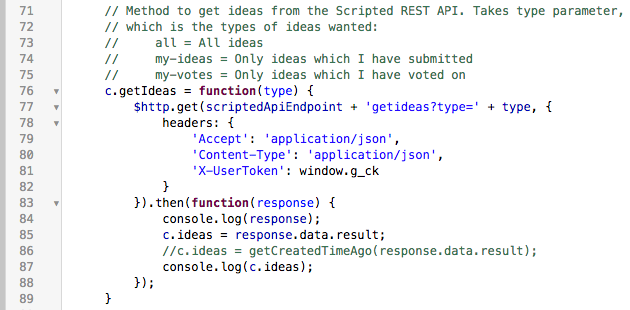

On line **77** we are making a HTTP GET request to the `getideas` endpoint of the Scripted REST API, passing in `type` as a parameter. The [`$http`](https://docs.angularjs.org/api/ng/service/$http) service is built into AngularJS and is used to make [AJAX](https://developer.mozilla.org/en-US/docs/Web/Guide/AJAX) calls.

When we get the response from the server, the function passed into `.then()` gets called, and within the function we can process an act upon the response as required.

### How it Works
On line **84** of the client script we are logging the response from the server. Open your browser console and examine the response. It should look similar to this:

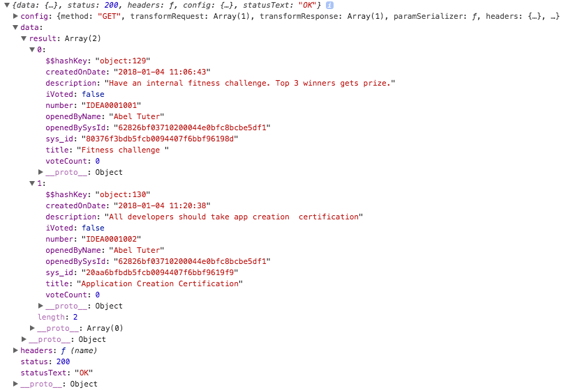

We are interested in two things here. First, that the status is `200`, which shows that the server reports that the request executed `OK` (which is also listed under `statusText`). Also, that the `result` property is an `Array` of two ideas. Once we get the response, the array in the result gets assigned to the `c.ideas` variable.

On line **2** of the HTML Template, we're using AngularJS' **ngRepeat** directive. This directive creates a copy of this element, and all it's child elements, for each of the items within the array passed into it (indicated by the red line).

In this case we're passing in the `c.ideas` array, and telling it we want to refer to each item by the variable name `idea`.

On lines **17** and **18** we're outputting the `title` and `description` of the idea.

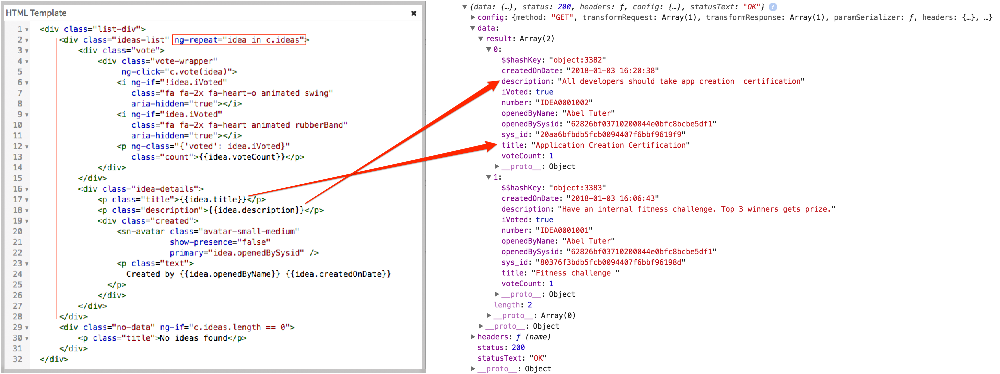

Lastly, on line **5** we are again using the **ngClick** directive, this time to call the `c.vote()` function. Inside this function we are making another call to the Scripted REST API, which will register that the user has voted for that idea.

### Verify the Changes

Open a new tab in your browser and navigate to `/ideas` on your instance. If you click on the heart icon, a vote for the idea will register and the heart icon will turn solid red as shown below.


You should also see the idea you have voted for after clicking **My Votes**.

**NOTE:** you cannot vote for your own idea.

## Record Watcher
What happens if another user has the list of ideas open at the same time, and votes on an idea? How can we ensure the vote count is always accurate without needing to refresh the page?

**Record Watcher** is an out-of-box Service Portal functionality which allows us to watch for changes to records in a performant way. Instead of getting the users's browser to go off and repeatedly ask if there are any changes (e.g. every second, which may cause performance issues), we can "subscribe" to changes to records, and the server will notify us if and when this happens.

On line **16** of the client script we are registering a Record Watcher on the **Vote** table. This means that whenever there is an update to a record in this table, the function passed in as the fourth parameter will get called. Within this function we can then update the UI accordingly.

### Verify the Changes
1. Open a new tab in your browser and navigate to `/ideas` on your instance.

2. Open a browser which you're not logged into (or an "incognito" window) and navigate to `/ideas` on your instance.
3. At the login screen in the incognito window, login as the below user:

	| Username         |  Password      |
	|---------------|-------------------------------------------|
	| `bessie.sutton`  | `bessie` |
	
4. Vote on an idea.
5. The vote count should increment automatically, even in your original window from step 1.


## Moment.js

In the UI, the creation date isn't in a human-readable format:


It would be much better if it were to say something like "*created 3 days ago*", which is what is sometimes referred to as **timeago format**. Fortunately, the **Moment.js** library comes out-of-box with Service Portal. [Moment.js](https://momentjs.com/) is a very powerful library to parse, validate, and manipulate dates in JavaScript. With the help of this library, we can easily convert this date to display in timeago format.

1. Open the **Idea List** widget in widget editor.

2. Comment out line **85** of the Client Script by adding two backslashes at the start of the line (`//`).
3. Un-comment line **86** by removing the two backslashes from the start of the line.

	The code should now look as shown below.
	
	
4. Save the widget.

### How it Works

The `getCreatedTimeAgo()` function will now parse the response we got back from the REST API. On line **97** we are creating a `moment()` object, passing into it the creation date of an idea. We are then calling the `fromNow()` function on it to convert the date to timeago format.


### Verify the Changes

Open a new tab in your browser and navigate to `/ideas` on your instance. The creation date of ideas should now appear like below:


## Widget Communication (continued)

On line **105** of the Client Script we are listening for the event `ideaPortal.applyFilter`, which is broadcast by the Idea Sidebar widget. Based on the type of filter clicked, the `c.getIdeas()` function is then called with that filter type.

### Verify

Whenever you click a link in the sidebar to filter the list of ideas you should see the log message from line **107** appear in your browser console, as shown below:


## Using External Libraries

It's very simple to leverage a third party library in your widget. Here in our example we will use a CSS library called **Animate.css**. [Animate.css](https://daneden.github.io/animate.css) is a bunch of cool, fun, and cross-browser animations.

1. Download the CSS file for Animate.css [from their website](https://daneden.github.io/animate.css)

	  
	
2. Open the **Idea List** widget in Studio, then from the hamburger menu select **Open in platform**.
3. In the **Dependencies** related list at the bottom of the page, click **New**.	

	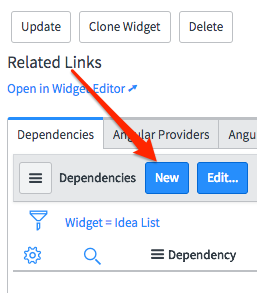  
	
4. Give the Dependency a name (e.g. "*Animate.css*"), then right-click the header and choose **Save**. In the **CSS Includes** related list, click **New**.

	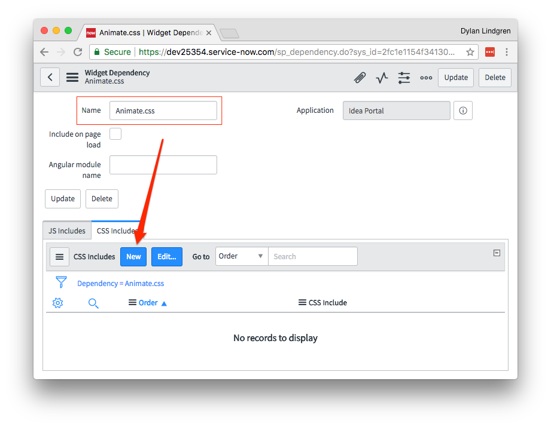

6. Give the CSS Include a name (e.g. "*Animate.css*"), then right-click the header and choose **Save**.
7. Now, select the magnifying glass icon next to the Stylesheet field. Create a new stylesheet record by selecting the **New** button.
8. Give the Style Sheet a name (e.g. "*Animate.css*"), and then copy and paste the contents of the downloaded animate.css file into the **CSS** field and press **Submit**. Press **Update** on the CSS Include record.

	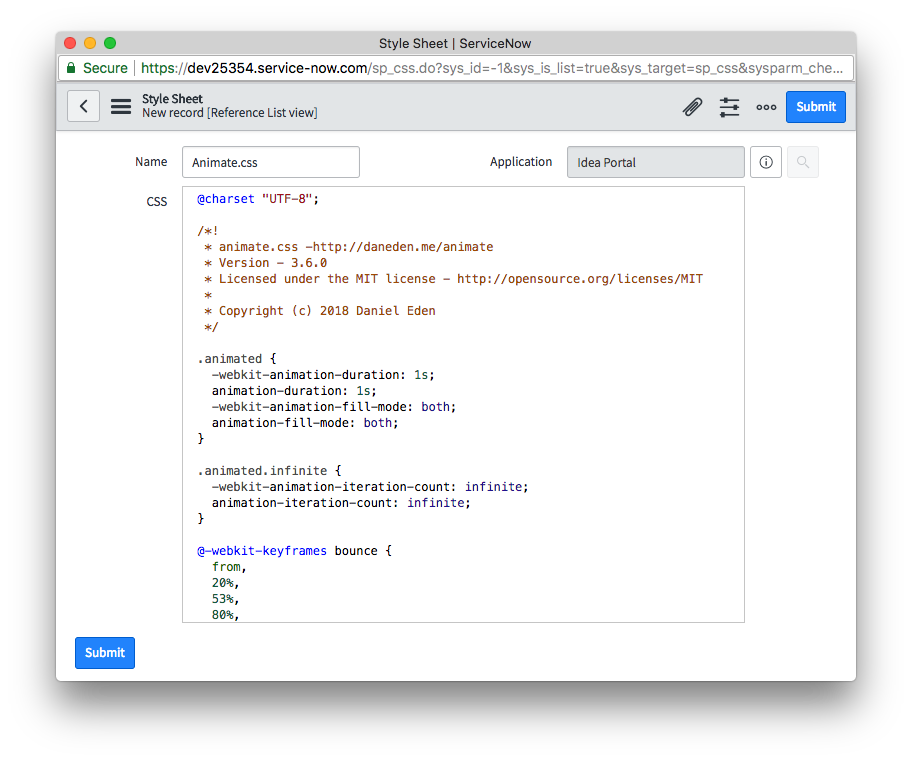
	
We have already added the necessary classes to the `i` elements in the Idea List widget. You can see below that on lines **7** and **10** of the HTML Template of the widget we have the class `animated` applied to both elements. This class is what Animate.css uses to ensure it attaches to this element. We also have the and `swing` and `rubberBand` classes, which are simply the type of animation to use. A different animation will be used when voting, and "un-voting".

 

### Verify

1. Open a new tab in your browser and navigate to `/ideas` on your instance.
2. Vote on an idea. The `rubberBand` animation should be used.
3. Un-vote on an idea. The `swing` animation should be used.

# Lab 6: Submit an Idea Page

## Goal
In this lab you will learn how to efficiently navigate between portal pages.

## Auto redirect on Idea submission

1. Open the **Idea Create** page in Service Portal Designer.

2. This page has two widgets on it. Click on the pencil icon for the **SC Catalog Item Deprecated** widget.
4. Make sure your widget options match the ones in the image below and save.

	

## Navigating Between Pages Using `$location`

1. Open a new tab in your browser and navigate to `/ideas` on your instance.

2. Open the developer tools of your browser, and switch to the **Network** tab.
3. Clear the history, and then click the **ADD AN IDEA** button. This will successfully navigate to a new page. Count the number of requests that were made in loading the page. There should be about **27** made.
	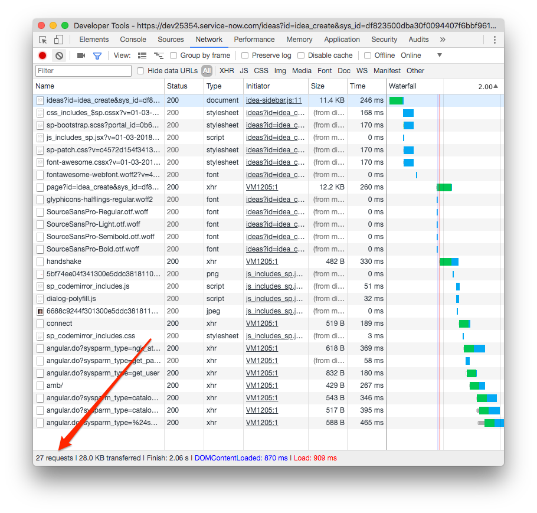
4. Open the **Idea Sidebar** widget in Studio.
2. Comment out line **22**, and remove the comments from lines **17**, **18**, **19**, and **20**, and then save the widget.

	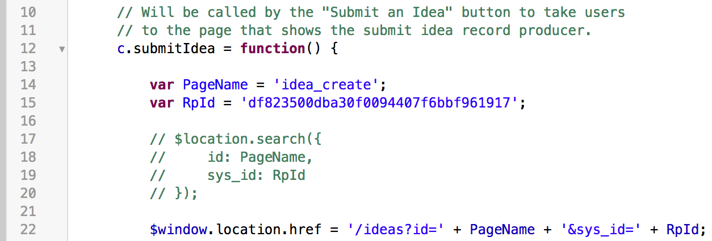

### Verify the Changes
1. Open a new tab in your browser and navigate to `/ideas` on your instance.

2. Open the developer tools of your browser, and switch to the **Network** tab.
3. Clear the network logs then click the **ADD AN IDEA** button. This will successfully navigate to a new page. Count the number of requests that were made in loading the page. There may be as little as **6** requests made!

	

### How it Works

Using AngularJS' `$location` service to navigate between pages is much more efficient than using `$window.location.href`. This is because `$window.location.href` causes the browser to do a full-page load, whereas using the `$location` service to URL parameters means only a partial load is done of only the widgets on the page and their dependencies.

# Bonus Lab: Data Tables
## Goal
In this bonus lab we will learn how to take the widget options concept even further, by adding brand new fields to our own custom Widget Instance table.
## Customisable Banner Widget
1. Open the **Idea Banner** widget in Studio, then from the hamburger menu select **Open in platform**.
2. Change the **Data table** field to point to the **Instance of Banner** table.
3. In the **Fields** field, add the following:
	- Background image
	- Align image
	- Heading
	- Heading text color
4. Clear the **Options schema** field and press the **Update** UI Action.
5. Open the **Idea Home** page in Service Portal Designer.
6. Delete the **Idea Banner** widget from the page, and then drag it back on so that it's in the same container.
7. Open the widget instance options by hovering over the widget and clicking the pencil icon. Fill out the options as follows:

	| Field         | Value                                 |
	|---------------|-------------------------------------------|
	| Background image        | *Download [idea-banner.png](resources/bonus-lab/idea-banner.png) and upload it to this field* |
	| Align image | center |
	| Heading | welcome to the ServiceNow Idea Portal |
	| Heading text colour | #d9534f |
	
	Note that the **Background image** and **Heading text color** are both field types which are not available from regular widget options. How did we do this? More on that later.
	
8. Click **Save**
	
### Verify the Changes
1. Open a new tab in your browser and navigate to `/ideas` on your instance.

	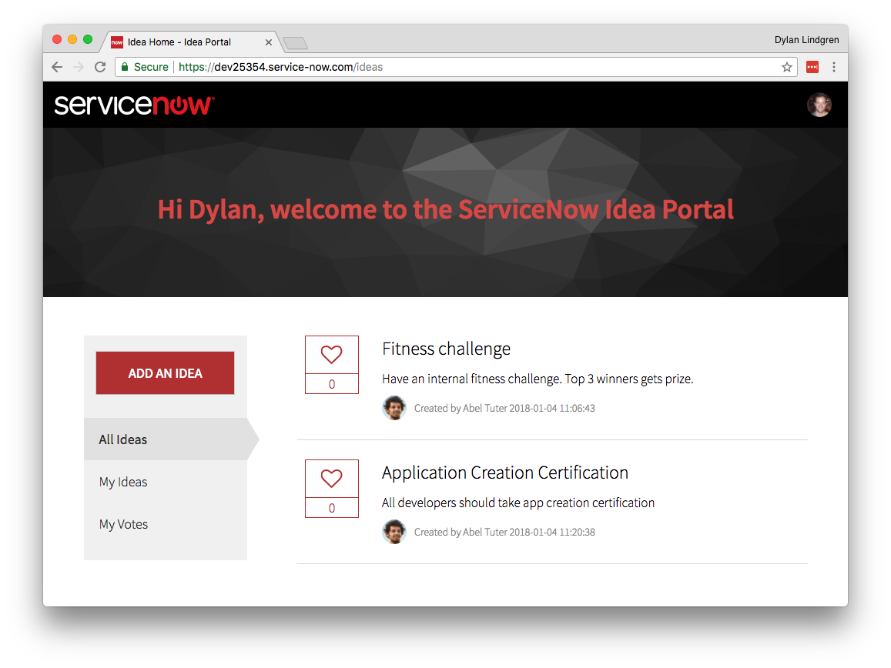
	
### How it Works

All widgets have a **Data table** field which by default points to the `sp_instance` table. Instead of using this default table, you can create a new table (extended from `sp_instance`) and it will be available for you to have your widgets point to this table.

The advantages of using a custom table to drive your widgets instead of the option schema are as follows.

- Field types can be any type available for a `sys_metadata` table, as opposed to the limited field types available in option schema.
- The widget's options dialog will use any UI Policies applied to the custom table.
-  You can configure the form layout, and what order the fields appear in.

When you drag and drop a widget onto a page using Service Portal Designer, a new widget instance record is created in the table selected as your widget's data table. 

There are many fields available on the default `sp_instance` table, but there may be cases where you want some different fields than those available on this table e.g. a script field. In this case you would create a new table extended from `sp_instance`, and add a script field to it.

## Extending the `sp_instance` Table
Let's add a few more fields to our custom widget instance table.

1. From Studio, open the **Instance of Banner** table.

2. Add the below two columns to the table, and then click **Update**.

	| Name         | Max length                                 |
	|---------------|-------------------------------------------|
	| Sub heading        | 40 |
	| Sub heading text color | 200 |
	
3. In Studio, open the form layout for the **Instance of Banner** table, in the **SP Instance Config** view.
4. Add the two new columns we created to the view under the **Presentation** section, then click **Save**.
5. Open the **Idea Banner** widget in Studio and add the two new columns we created to the **Fields** field's slushbucket, and click the **Update** UI Action.
6. Open the **Idea Home** page in Service Portal Designer, and open the widget options for the banner.
7. Set the new fields to have the below values:

	| Field         | Value                                 |
	|---------------|-------------------------------------------|
	| Sub heading        | We love hearing from our employees. Please share your ideas here. |
	| Sub heading text color | #fff |

### Verify the Changes
Open a new tab in your browser and navigate to `/ideas` on your instance.

// TODO: IMAGE

The new fields on the table we created can be accessed the same way any other options are accessed, in the format `c.options.COLUMN_NAME`.

// TODO: IMAGE

# Resources
## Useful Links
### ServiceNow Resources
- [Widget Communication](https://community.servicenow.com/community/develop/blog/2016/06/26/how-to-communicate-between-two-widgets-in-service-portal)

### Non-ServiceNow Resources
- [Service Portal Fundamentals: AngularJS Scopes](https://www.dylanlindgren.com/2017/10/28/service-portal-fundamentals-angularjs-scopes/)
- [One Quick Tip for Single Page Apps in Service Portal](https://www.dylanlindgren.com/2018/02/15/one-quick-tip-for-single-page-apps-in-service-portal/)
- [Animate.css](https://daneden.github.io/animate.css/)
- [Moment.js](https://momentjs.com/)